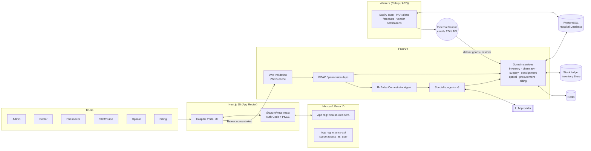
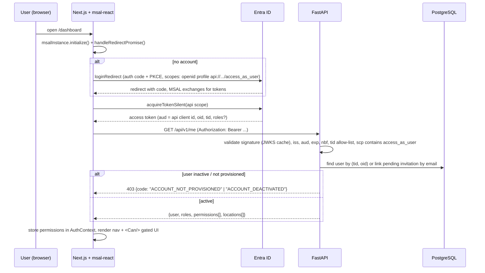
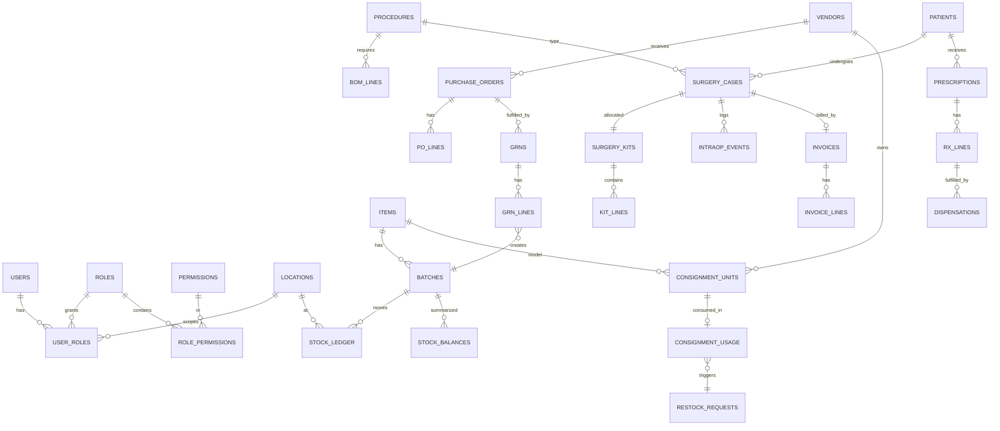
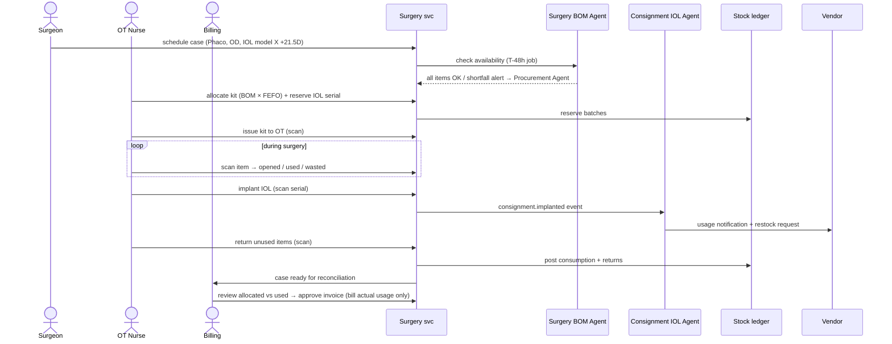

# RxPulse for an Eye Care Hospital: Implementation Plan

**Stack:** FastAPI (Python 3.12) backend · Next.js 15 (App Router, TypeScript) frontend · PostgreSQL 16 · Redis · Microsoft Entra ID (MSAL) · in-app RBAC · LLM agent layer

This plan covers:

- how the agent architecture diagram (RxPulse Orchestrator plus 8 specialist agents) maps to backend services, and
- how the reference MedStock IQ UI (sidebar shell, RBAC screen, FEFO sales orders, batch inventory) is adapted for an **eye care hospital**. That means a hospital pharmacy, an OT/surgery store, vendor-owned IOL consignment stock, an optical shop, and billing.

---

## Contents

1. [Scope and domain](#1-scope-and-domain)
2. [System architecture](#2-system-architecture)
3. [Authentication with MSAL / Entra ID](#3-authentication-with-msal--entra-id)
4. [RBAC design](#4-rbac-design)
5. [Data model](#5-data-model)
6. [Backend (FastAPI)](#6-backend-fastapi)
7. [Agent layer](#7-agent-layer)
8. [Frontend (Next.js)](#8-frontend-nextjs)
9. [Key workflows](#9-key-workflows)
10. [Non-functional requirements](#10-non-functional-requirements)
11. [Testing strategy](#11-testing-strategy)
12. [Deployment](#12-deployment)
13. [Delivery phases](#13-delivery-phases)
14. [Issues seen in the reference UI](#14-issues-seen-in-the-reference-ui)

---

## 1. Scope and domain

### Actors (from the architecture diagram)

| Actor | Primary use of the portal |
|---|---|
| **Admin** | Dashboard, approvals (POs, write-offs, returns), staff and role management |
| **Doctor / Surgeon** | Prescriptions (drops, oral meds), surgery orders (procedure plus IOL power/model) |
| **Pharmacist** | Dispense medications, FEFO picking, Schedule H/H1 register |
| **Staff / OT Nurse** | Scan items into/out of surgery kits, log intra-op usage |
| **Store Keeper** | Goods receipt, bins, transfers, stock adjustments |
| **Procurement Officer** | Vendors, purchase orders, restock |
| **Optical Shop Staff** | Frames/lens/contact-lens sales, spectacle job orders |
| **Billing / Accountant** | Reconciliation, patient invoices, vendor payables |
| **Analyst** | Read-only reports and forecasts |

### Stock domains specific to eye care

| Domain | Examples | Special handling |
|---|---|---|
| Pharmacy drugs | Moxifloxacin drops, Prednisolone acetate, Atropine, Timolol, Tropicamide | Batch plus expiry, **FEFO**, PAR levels, Schedule H/H1 register |
| High-value drugs | Anti-VEGF injections (Ranibizumab, Aflibercept, Bevacizumab), Mitomycin-C | **Serial-level tracking**, cold-chain flag, per-dose accounting |
| Surgical consumables | Viscoelastic (OVD), BSS, blades (keratome 2.8mm, 15°), cannulas, drapes, sutures (10-0 nylon), phaco packs | Batch/expiry, BOM-driven kits, open-vs-used tracking |
| **IOLs (consignment)** | Monofocal/toric/multifocal, by model and **diopter power** (e.g. +21.5D) | **Vendor-owned** until implanted, serial per lens, auto restock notification |
| Optical shop | Frames, spectacle lenses (by index/coating/Rx), contact lenses, solutions | Retail SKUs, dead stock, margin analytics, lab job orders |

### Surgical procedures to model as BOMs (seed data)

Phaco cataract with IOL, MSICS, Trabeculectomy, Pars plana vitrectomy, Intravitreal injection, DSEK/DMEK, Pterygium excision with graft, LASIK/PRK, Squint correction.

---

## 2. System architecture



**Design principles**

1. **Agents never bypass the domain layer.** Every agent tool is a thin wrapper over the same service functions the REST API uses. RBAC, validation and audit apply equally to humans and agents.
2. **Agents act on behalf of the signed-in user.** An agent inherits the caller's permissions and never gets more. Background (system) agents run as a service principal with a narrow, explicit permission set.
3. **Agents propose; humans approve writes.** Agents draft POs, restock requests, invoices and adjustments. Anything that moves money or stock needs a human approval unless a policy says otherwise.
4. **The stock ledger is append-only.** Balances are derived. Every movement links back to a source document (GRN, dispense, kit issue, intra-op usage, return, adjustment).

---

## 3. Authentication with MSAL / Entra ID

### 3.1 App registrations

| Registration | Type | Settings |
|---|---|---|
| `rxpulse-web` | **Single-page application** | Redirect URIs `http://localhost:3000`, `https://<prod-domain>`. No client secret. API permission: `rxpulse-api/access_as_user` (admin-consented). |
| `rxpulse-api` | Web API | Application ID URI `api://<api-client-id>`. Exposes scope `access_as_user`. Manifest `requestedAccessTokenVersion: 2`. Defines **one app role, `RxPulse.SuperAdmin`**, used only for bootstrap and break-glass access. |
| `rxpulse-worker` (optional) | Daemon | Client credentials, app role `RxPulse.System`, used by scheduled agents. |

> **Why keep most roles in the app instead of Entra app roles?** The reference UI (Staff & Roles) lets admins create **custom roles** and edit **granular permissions** at runtime, and assign them per location. Entra app roles can't be edited from inside the app and don't support location scoping. So Entra handles *authentication* (who you are), and RBAC in RxPulse handles *authorization* (what you can do). The one Entra role, `RxPulse.SuperAdmin`, means you can never lock yourself out.

### 3.2 Login and token flow



### 3.3 Backend token validation (`app/core/security.py`)

- Use `PyJWT` with `PyJWKClient("https://login.microsoftonline.com/{TENANT_ID}/discovery/v2.0/keys")`, cached for 24h, with a forced refresh on unknown `kid`.
- Validate these claims:
  - `iss == https://login.microsoftonline.com/{tid}/v2.0`
  - `aud == API_CLIENT_ID`
  - `exp`/`nbf` with 60s leeway
  - `tid` in `ALLOWED_TENANTS`
  - `scp` contains `access_as_user` (delegated), **or** `roles` contains `RxPulse.System` with no `scp` (app-only worker)
- Build the `Principal` like this:

```python
@dataclass(frozen=True)
class Principal:
    user_id: UUID            # internal users.id
    oid: str                 # Entra object id
    tid: str
    email: str
    is_system: bool
    permissions: frozenset[str]          # effective, after role + location resolution
    location_ids: frozenset[UUID] | None # None = all locations
```

- Resolve effective permissions from the DB and cache them in Redis (`perm:{user_id}`, TTL 5 min). **Invalidate** the cache on any role, permission or assignment change and on deactivation, so changes apply within seconds.

### 3.4 User provisioning

1. An admin clicks **Add Staff Member** (email, name, role(s), location(s)). This creates a `users` row with `status=invited` and no `oid` yet. It can also send an Entra B2B invite through Microsoft Graph for external staff (optional, phase 3).
2. On first login, `/me` matches the token's `preferred_username`/`email` (case-insensitive) to the invited row, stores `oid` + `tid`, and sets `status=active`.
3. Tokens with `roles` containing `RxPulse.SuperAdmin` are auto-provisioned with the Super Admin role.
4. Anyone else gets `403 ACCOUNT_NOT_PROVISIONED`. The frontend shows a "Contact your administrator" page, not a blank screen.
5. **Deactivate** sets `status=inactive` and clears the permission cache. From the next request on, every call returns 403 even though the Entra token is still valid.

### 3.5 Frontend MSAL setup

```ts
// src/lib/auth/msalConfig.ts
export const msalConfig: Configuration = {
  auth: {
    clientId: process.env.NEXT_PUBLIC_AZURE_CLIENT_ID!,
    authority: `https://login.microsoftonline.com/${process.env.NEXT_PUBLIC_AZURE_TENANT_ID}`,
    redirectUri: process.env.NEXT_PUBLIC_REDIRECT_URI,       // e.g. http://localhost:3000
    postLogoutRedirectUri: "/login",
    navigateToLoginRequestUrl: true,
  },
  cache: { cacheLocation: "sessionStorage" },                // shared kiosks in wards/OT → not localStorage
};
export const apiScopes = [`api://${process.env.NEXT_PUBLIC_API_CLIENT_ID}/access_as_user`];
```

- `src/app/providers.tsx` (client component): create the `PublicClientApplication` once. `await initialize()` and `handleRedirectPromise()` must finish before rendering `<MsalProvider>`.
- `AuthGate` wraps the `(app)` route group. It uses `useIsAuthenticated` and `MsalAuthenticationTemplate` with `InteractionType.Redirect`, then loads `/me` into an `AuthContext`.
- The API client (`src/lib/api/client.ts`) gets tokens with `acquireTokenSilent({ scopes: apiScopes, account })` and falls back to `acquireTokenRedirect` on `InteractionRequiredAuthError`. On a **401** it retries once with `forceRefresh`. On a **403** it shows a permission toast.
- **Shared OT and nurse-station terminals:** set an idle timeout (default 15 min, configurable in Settings). When it fires, call `logoutRedirect` and clear the TanStack Query cache.
- Next.js middleware **can't** see MSAL tokens (they live in browser storage), so route protection happens client-side for UX. **The API is the only real enforcement point.** A later option is a BFF with httpOnly cookies using `@azure/msal-node`; the API contract doesn't change.

---

## 4. RBAC design

### 4.1 Model

```
Permission  = "<resource>:<action>"        e.g. "po:approve"
Role        = named set of permissions     (system roles are locked; custom roles are editable)
UserRole    = (user, role, location_id?)   location_id NULL → applies to all locations
Effective   = ∪ permissions of all user's roles, filtered to the request's location
```

Locations (seed): `Central Warehouse`, `Main Pharmacy`, `OT Store`, `Optical Shop`, plus satellite clinics.

### 4.2 Permission catalogue

| Module | Permissions |
|---|---|
| Dashboard | `dashboard:view` |
| Inventory | `inventory:view` · `inventory:adjust` · `inventory:transfer` · `inventory:writeoff` · `inventory:writeoff_approve` · `item:manage` |
| Procurement | `vendor:view` · `vendor:manage` · `po:view` · `po:create` · `po:approve` · `grn:create` |
| Pharmacy | `rx:view` · `rx:create` (doctor) · `dispense:create` · `controlled:register_view` |
| Surgery | `surgery:view` · `surgery:schedule` · `bom:view` · `bom:manage` · `kit:issue` · `intraop:log` · `kit:return` |
| Consignment IOL | `consignment:view` · `consignment:receive` · `consignment:consume` · `consignment:restock_request` |
| Optical shop | `optical:view` · `optical:sell` · `optical:job_order` · `optical:price_manage` |
| Billing | `billing:view` · `billing:reconcile` · `invoice:create` · `invoice:void` · `payable:manage` |
| Analytics | `reports:view` · `reports:export` · `forecast:view` |
| AI | `ai:chat` · `ai:approve_actions` |
| Admin | `staff:view` · `staff:manage` · `role:manage` · `audit:view` · `settings:manage` |

### 4.3 Default role matrix (seeded, `is_system=true`)

| Role | Key permissions |
|---|---|
| **Super Admin** | `*` (all). Cannot be deleted. At least one active holder must always exist. |
| **Hospital Admin** | Everything except `settings:manage`/`role:manage` on system roles; includes all `*:approve` |
| **Doctor / Surgeon** | `rx:*`, `surgery:view`, `surgery:schedule`, `bom:view`, `consignment:view`, `forecast:view`, `ai:chat` |
| **Pharmacist** | `inventory:view`, `rx:view`, `dispense:create`, `controlled:register_view`, `inventory:adjust`, `ai:chat` |
| **OT Nurse / Staff** | `surgery:view`, `bom:view`, `kit:issue`, `intraop:log`, `kit:return`, `consignment:consume` |
| **Store Keeper** | `inventory:*` (not `writeoff_approve`), `grn:create`, `consignment:receive`, `po:view` |
| **Procurement Officer** | `vendor:*`, `po:view`, `po:create`, `consignment:restock_request`, `forecast:view` |
| **Optical Shop Staff** | `optical:view`, `optical:sell`, `optical:job_order`, `inventory:view` (location-scoped to Optical Shop) |
| **Billing / Accountant** | `billing:*`, `invoice:*`, `payable:manage`, `reports:view` |
| **Analyst** | `*:view`, `reports:*`, `forecast:view` (read-only) |

**Segregation-of-duties rules** (enforced in the service layer, not just in the UI):

- A PO creator cannot approve their own PO.
- A write-off requester cannot approve it.
- A user can't remove their own `staff:manage` or `role:manage`.
- The last active Super Admin can't be deactivated.

### 4.4 Enforcement in FastAPI

```python
# app/api/deps.py
def require(*perms: str, location_param: str | None = None):
    async def dep(principal: Principal = Depends(get_principal), request: Request = None):
        loc = request.path_params.get(location_param) if location_param else None
        if not principal.has_all(perms, location_id=loc):
            raise HTTPException(403, {"code": "FORBIDDEN", "missing": list(perms)})
        return principal
    return dep

@router.post("/purchase-orders/{po_id}/approve")
async def approve_po(po_id: UUID, p: Principal = Depends(require("po:approve"))):
    return await procurement.approve_po(po_id, actor=p)   # SoD check inside the service
```

- Row-level scoping: list queries go through `scoped(query, principal)`, which adds `location_id IN principal.location_ids`.
- Patient data (Rx, surgery cases, invoices) needs a module permission **and** a location match.

### 4.5 Enforcement in Next.js (UX only)

```tsx
<Can permission="po:approve"><Button>Approve</Button></Can>
const canEdit = usePermission("role:manage");
```

- The sidebar is built from a nav config where each entry has `requires: "inventory:view"`. Links the user can't access are hidden.
- Each route segment also has a `PermissionGuard`. Deep-linking to a forbidden page shows a 403 page.

---

## 5. Data model

All tables have `id UUID PK`, `created_at`, `updated_at`, `created_by`, and `updated_by`. Money is `NUMERIC(14,2)` in INR, with GST fields. Soft delete only on master data.



### Table notes

| Area | Tables | Notes |
|---|---|---|
| Identity/RBAC | `users(oid, tid, email, display_name, status[invited/active/inactive])`, `roles(name, description, is_system)`, `permissions(code, module, description)`, `role_permissions`, `user_roles(user_id, role_id, location_id NULL)` | Unique `(tid, oid)`. Unique lower(email). |
| Master | `locations`, `bins`, `items(sku, name, generic, type[drug/consumable/iol/frame/spectacle_lens/contact_lens/equipment], schedule[H/H1/X/none], hsn, gst_rate, uom, par_min, par_max, is_serialized, is_cold_chain)`, `iol_specs(item_id, model, optic_type, diopter_min/max/step, a_constant)`, `vendors(gstin, contact, lead_time_days, channel[email/api])` | IOL specs drive power-matching |
| Stock | `batches(item_id, batch_no, expiry_date, mfg_date, mrp, unit_cost, vendor_id, serial_no NULL)`, `stock_ledger(batch_id, location_id, bin_id, qty_delta, reason, ref_type, ref_id, idempotency_key UNIQUE)`, `stock_balances(batch_id, location_id, bin_id, qty_on_hand, qty_reserved)` | `stock_balances` is updated in the **same transaction** as the ledger insert, using `SELECT … FOR UPDATE`. A CHECK keeps `qty_on_hand >= 0`. |
| Procurement | `purchase_orders(status[draft/pending_approval/approved/sent/partially_received/closed/cancelled], source[manual/agent])`, `po_lines`, `grns`, `grn_lines` | |
| Consignment | `consignment_units(vendor_id, item_id, serial_no, diopter, status[in_stock/reserved/implanted/returned], location_id)`, `consignment_usage(unit_id, surgery_case_id, implanted_at, notified_vendor_at)`, `restock_requests(vendor_id, lines, status)` | Consignment units are **not** hospital assets (valuation excluded) until implanted, when a payable is created |
| Clinical (minimal) | `patients(mrn, name, dob, gender, phone)` (or HIS reference), `prescriptions`, `rx_lines(item_id, dose, eye[OD/OS/OU], frequency, duration)`, `dispensations(rx_line_id, batch_id, qty)` | Keep PHI to a minimum. MRN links to the HIS if one exists. |
| Surgery | `procedures(code, name, default_duration)`, `bom_lines(procedure_id, item_id, qty, is_optional, substitution_group)`, `surgery_cases(patient_id, procedure_id, surgeon_id, eye, scheduled_at, iol_item_id, iol_power, status)`, `surgery_kits(case_id, status[allocated/issued/returned/reconciled])`, `kit_lines(kit_id, batch_id or consignment_unit_id, qty_allocated, qty_used, qty_returned, qty_wasted)`, `intraop_events(case_id, kit_line_id, action[opened/used/wasted/added], qty, scanned_barcode, actor_id, ts)` | |
| Billing | `invoices(patient_id, case_id, status, subtotal, gst, total)`, `invoice_lines`, `payments`, `vendor_payables` | |
| Optical | `optical_orders(patient_id, type[sale/job_order])`, `optical_order_lines`, `spectacle_rx(sph, cyl, axis, add, pd, per eye)`, `lab_job_orders` | |
| Analytics | `forecasts(item_id, location_id, period, qty_pred, method, generated_at)`, `alerts(type[expiry/par/stockout/dead_stock/burn_rate], severity, item_id, status)` | |
| AI | `agent_runs(user_id, agent, input, status, tokens, cost)`, `agent_tool_calls(run_id, tool, args, result, duration)`, `proposed_actions(run_id, type, payload, status[pending/approved/rejected/executed], approver_id)`, `chat_threads`, `chat_messages` | |
| Audit | `audit_log(actor_id, actor_type[user/agent/system], action, entity_type, entity_id, before, after, ip, request_id, ts, prev_hash, hash)` | Append-only. The DB role has no UPDATE/DELETE. A hash chain provides tamper evidence. |

---

## 6. Backend (FastAPI)

### 6.1 Project layout

```
backend/
├── pyproject.toml              # uv; fastapi, uvicorn, sqlalchemy[asyncio]>=2, asyncpg, alembic,
│                               # pydantic-settings, pyjwt[crypto], redis, arq, httpx, structlog, anthropic
├── alembic/                    # migrations
├── app/
│   ├── main.py                 # app factory, CORS, middleware (request-id, audit ctx, timing)
│   ├── core/
│   │   ├── config.py           # Settings (env): TENANT_ID, API_CLIENT_ID, ALLOWED_TENANTS, DB_URL, REDIS_URL, LLM_*
│   │   ├── security.py         # Entra JWT validation, Principal
│   │   ├── rbac.py             # permission resolution, cache, SoD helpers
│   │   └── errors.py           # problem+json error model
│   ├── db/ (session.py, base.py)
│   ├── models/                 # SQLAlchemy ORM, one module per domain
│   ├── schemas/                # Pydantic v2 request/response models
│   ├── services/               # domain logic, the ONLY place that writes
│   │   ├── stock.py            # ledger posting, FEFO allocator, reservations
│   │   ├── procurement.py  pharmacy.py  surgery.py  consignment.py
│   │   ├── optical.py  billing.py  analytics.py  staff.py  audit.py
│   ├── api/v1/                 # routers (thin; call services)
│   ├── agents/
│   │   ├── orchestrator.py     # intent routing + tool loop
│   │   ├── registry.py         # agent → tools → required permissions
│   │   ├── tools/              # one module per specialist agent
│   │   └── prompts/
│   ├── workers/                # arq jobs: expiry_scan, par_check, forecast, vendor_notify
│   └── integrations/           # vendor email/EDI, Graph (invites), HIS (optional)
└── tests/
```

### 6.2 API surface (`/api/v1`)

| Router | Endpoints (permission) |
|---|---|
| `me` | `GET /me` (authenticated) → user, roles, permissions, locations |
| `staff` | `GET /staff` (staff:view) · `POST /staff` invite (staff:manage) · `PATCH /staff/{id}` · `POST /staff/{id}/deactivate` · `POST /staff/{id}/reactivate` · `PUT /staff/{id}/roles` |
| `roles` | `GET /roles` (with `permission_count`, `user_count`) · `POST /roles` · `PATCH /roles/{id}` · `PUT /roles/{id}/permissions` · `DELETE /roles/{id}` (role:manage; system roles are read-only) · `GET /permissions` |
| `items` | CRUD `/items`, `GET /items/{id}/stock` (inventory:view / item:manage) |
| `inventory` | `GET /batches?status=&location=&expiring_within=&sort=` · `GET /batches/{id}` · `POST /stock/adjustments` · `POST /stock/transfers` · `POST /stock/writeoffs` + `/approve` · `GET /stock/expiry-risk` · `POST /stock/fefo/preview` (dry-run allocation) |
| `procurement` | `/vendors` CRUD · `/purchase-orders` CRUD · `POST /purchase-orders/{id}/submit` · `/approve` · `/send` · `POST /grns` (receive into warehouse, creates batches) |
| `pharmacy` | `/prescriptions` (rx:create) · `GET /prescriptions/queue` · `POST /dispensations` (FEFO auto-pick, returns pick list) · `GET /registers/schedule-h1` |
| `consignment` | `GET /consignment/units?model=&diopter=` · `POST /consignment/receive` · `POST /consignment/units/{id}/reserve` · `POST /consignment/units/{id}/implant` · `GET/POST /consignment/restock-requests` |
| `surgery` | `/procedures` + `/procedures/{id}/bom` · `/surgery-cases` CRUD · `POST /surgery-cases/{id}/kit` (allocate from BOM with FEFO + IOL reserve) · `POST /kits/{id}/issue` · `POST /surgery-cases/{id}/intraop-events` (barcode scan) · `POST /kits/{id}/return` |
| `billing` | `POST /surgery-cases/{id}/reconcile` → returns allocated vs used diff · `POST /invoices` · `GET /invoices/{id}/pdf` · `POST /invoices/{id}/void` · `/payables` |
| `optical` | `/optical/orders` · `/optical/job-orders` · `GET /optical/analytics` |
| `analytics` | `GET /dashboard/summary` · `GET /reports/{name}?format=csv/xlsx` · `GET /forecasts` · `GET /alerts` + `PATCH` ack |
| `ai` | `POST /ai/chat` (SSE stream) · `GET /ai/threads` · `GET /ai/actions?status=pending` · `POST /ai/actions/{id}/approve` · `/reject` |
| `audit` | `GET /audit?entity=&actor=&from=&to=` (audit:view) |

Conventions:

- Cursor or offset pagination (`?page=&page_size=`, max 100) with a `total` in the response, which the "Showing X of Y" UI needs.
- An `Idempotency-Key` header is required on every stock-moving POST.
- Errors use `application/problem+json`.
- The OpenAPI schema is exported to generate the frontend TS client.

### 6.3 Core algorithms

**FEFO allocation** (`services/stock.py`)

```
allocate(item_id, qty, location_id, exclude_expiring_within_days=30 (drugs) / 90 (implants)):
  SELECT b.*, sb.qty_on_hand - sb.qty_reserved AS free
  FROM stock_balances sb JOIN batches b ...
  WHERE item_id = :item AND location_id = :loc AND free > 0
        AND b.expiry_date > now() + min_shelf_life
  ORDER BY b.expiry_date ASC, b.created_at ASC
  FOR UPDATE OF sb SKIP LOCKED
  → greedily take until qty satisfied; raise InsufficientStock with shortfall otherwise
```

**Consignment IOL match:** find `consignment_units` where `status='in_stock'` and the model and power match exactly (the surgeon may allow ±0.5D alternates). Reserve at kit allocation. `implant` changes status to `implanted`, creates a `consignment_usage` row, a `vendor_payable`, and a patient invoice line. It then enqueues `vendor_notify` and checks par for that model/power to create a `restock_request`.

**Reconciliation:** for each `kit_line`, `used = Σ intraop used`, `wasted = Σ intraop wasted`, and `returned = allocated − used − wasted`. Returned quantity goes back to stock through a ledger `return` entry. The patient is billed for **used + wasted-if-billable** only. Any variance above threshold raises an alert for Admin.

---

## 7. Agent layer

### 7.1 Orchestrator

- A **tool-using LLM loop**. The provider is configurable (`LLM_PROVIDER`, `LLM_MODEL`); the default is a Claude model through the Anthropic SDK.
- Step 1: an intent classifier (cheap model or rules) picks one or more specialist agents.
- Step 2: the specialist runs with **only its own tools**, and those are further filtered to the ones the principal has permissions for.
- Responses stream to the UI over SSE: token deltas, tool-call progress ("Querying batches…"), then a final message plus any `proposed_actions`.
- Guardrails:
  - max 8 tool calls per turn
  - per-user rate limit
  - PHI is redacted from prompts unless the tool needs it
  - every tool call is audited as `actor_type=agent` with `on_behalf_of=user_id`

### 7.2 Specialist agents (mapped from the architecture diagram)

| Agent | Read tools | Write tools (→ proposed action unless noted) | Triggers |
|---|---|---|---|
| **Procurement** | `get_par_breaches`, `get_vendor_catalog`, `get_open_pos` | `draft_purchase_order` → PO in `draft`, needs `po:approve` | PAR alert, forecast shortfall, chat |
| **Pharmacy** | `get_stock`, `get_expiring`, `get_rx_queue` | `propose_transfer`, `propose_writeoff` | Nightly expiry scan (FEFO rotation, PAR alerts), chat |
| **Consignment IOL** | `find_iol(model, power)`, `get_consignment_levels` | `create_restock_request` (**auto-executes** under a vendor policy, since it's vendor-owned and costs nothing), `notify_vendor` | `consignment.implanted` event |
| **Retail Analytics** (optical) | `sales_trend`, `dead_stock(days=180)`, `margin_by_category` | none (read-only) | Weekly report, chat |
| **Surgery BOM** | `get_bom(procedure)`, `check_kit_availability(case_id)` | `propose_bom_change` (needs `bom:manage`) | Case scheduled → availability check 48h before |
| **Intra-Op Tracking** | `get_kit(case_id)`, `get_usage_log` | `log_usage` (direct, **user-initiated only**, e.g. voice/scan) | Live case |
| **Reconciliation & Billing** | `reconcile_case`, `get_tariff` | `draft_invoice` → billing approves | Case status `completed` |
| **Predictive Analytics** | `historical_consumption`, `surgery_schedule`, `seasonality` | `publish_forecast`, `raise_alert` | Nightly job |

Forecasting (phase 4):

- Start with per-SKU seasonal baselines (for example, conjunctivitis-season spikes in antibiotic drops, and scheduled surgery volume driving OVD/BSS/IOL demand) using statsmodels ETS.
- The **surgery schedule is a leading indicator**: demand for BOM items over the next 14 days is mostly known from the schedule.
- Burn-rate alerts fire when 7-day consumption is more than 1.5× the forecast.
- The LLM explains forecasts; it doesn't compute them.

---

## 8. Frontend (Next.js)

### 8.1 Stack

Next.js 15 App Router · TypeScript · Tailwind CSS · shadcn/ui (Radix) · lucide-react icons (matches the reference) · TanStack Query · TanStack Table · react-hook-form + zod · `openapi-typescript` + `openapi-fetch` for a typed API client · Recharts · `@azure/msal-browser` + `@azure/msal-react` · `html5-qrcode` / camera barcode scanning for OT.

### 8.2 Layout

```
frontend/src/
├── app/
│   ├── layout.tsx                 # fonts, <Providers> (MSAL, Query, Theme, Toaster)
│   ├── login/page.tsx             # "Sign in with Microsoft"
│   ├── unauthorized/page.tsx      # not provisioned / deactivated / 403
│   └── (app)/                     # AuthGate + AppShell (sidebar, top bar, copilot)
│       ├── dashboard/
│       ├── ai-studio/
│       ├── inventory/             # tabs: active-batches | catalog | fefo | expiry-risk | adjustments
│       ├── pharmacy/              # rx-queue | dispense/[rxId] | registers
│       ├── surgery/               # schedule | cases/[id] (kit, intra-op, reconcile) | bom
│       ├── consignment/           # iol-stock | usage | restock-requests
│       ├── optical/               # pos | job-orders | analytics
│       ├── purchasing/            # purchase-orders | grn | vendors
│       ├── billing/               # reconciliation | invoices | payables
│       ├── reports/
│       ├── staff/                 # Staff & Roles (RBAC)
│       ├── audit/
│       └── settings/
├── components/
│   ├── shell/ (Sidebar, TopBar, LocationSwitcher, GlobalSearch ⌘K, NotificationBell, CopilotDock)
│   ├── data-table/ (DataTable, Toolbar with search + filter + sort + refresh, "Showing X of Y", pagination)
│   ├── auth/ (AuthGate, Can, PermissionGuard)
│   └── ui/ (shadcn)
├── lib/
│   ├── auth/ (msalConfig, AuthContext, usePermission)
│   ├── api/ (client.ts, schema.d.ts generated, queries/*)
│   └── nav.ts                     # nav items with `requires` permission + badge source
└── types/
```

### 8.3 Screen map (following the reference UI)

| Sidebar item | Screen | Notes |
|---|---|---|
| **Dashboard** | KPI tiles (stock value, expiring in 30/60/90 days, stock-outs, today's surgeries, pending approvals), alerts list, surgery kit readiness | Tiles are role-aware: a nurse sees today's cases, billing sees unreconciled cases |
| **AI Studio** (Agent badge) | Full chat with the orchestrator. Streaming, tool-call timeline, **Proposed Actions** cards with Approve/Reject | The floating "Ask RxPulse Assist" button opens the same chat in a drawer |
| **Inventory** (count badge) | Tabs as in the reference: *All Active Batches · Medicines Catalog · FEFO Allocation Engine · Expiry Risk Analysis · Stock Adjustments*. Columns: Item & SKU, Batch, Inward date, Expiry (colour-coded relative chip), Status, Available, Location/Bin, Valuation, Actions (View/Edit/Transfer) | Location filter. IOLs shown with power. |
| **Pharmacy** | Rx queue → dispense screen with auto FEFO pick list, barcode verify, print label | Schedule H1 register view |
| **Surgery** | Calendar/list of cases → case page with steps **Kit → Issue → Intra-op → Return → Reconcile** | Intra-op screen is **tablet-first** with big scan button and +/−/wasted per line, and works offline-tolerant (queued mutations) |
| **Consignment IOL** | Matrix view: model × diopter grid with on-hand counts; usage log; restock requests with vendor status | |
| **Optical Shop** | POS-style sale, spectacle Rx entry, lab job orders, retail analytics (dead stock, margin) | |
| **Purchasing** | POs list (status chips, source: Manual/Agent), PO detail with approval, GRN receiving with batch/expiry capture | |
| **Billing** | Reconciliation queue (allocated vs used table), invoices list/detail/PDF, vendor payables | |
| **Reports** | Consumption, expiry loss, procedure costing, vendor performance, forecasts; export CSV/XLSX | |
| **Staff & Roles** | Left: **Registered Staff Accounts** table (Name, Email, **Assigned Role(s)**, **Location scope**, Status, Last sign-in, Edit / Deactivate). Right: **System & Custom Roles** list with **real permission counts** and user counts. Role editor: permission matrix grouped by module with checkboxes. **Add Staff Member** dialog. | Destructive actions use confirmation dialogs, not `window.confirm` |
| **Audit Trail** | Filterable log with before/after diff viewer, actor type (user/agent/system) | |
| **Settings** | Locations, bins, thresholds (min shelf-life, PAR defaults, idle timeout), vendor channels, LLM settings | |

---

## 9. Key workflows

### 9.1 Cataract surgery end-to-end



### 9.2 Replenishment

Nightly PAR check or forecast shortfall → the **Procurement Agent** drafts a PO grouped by vendor → an approver with `po:approve` reviews it in Purchasing or in the AI Studio action card → PO is sent (email PDF / vendor API) → Store Keeper posts the GRN with batch and expiry → stock becomes available in the warehouse → transfers to Pharmacy / OT Store.

### 9.3 Expiry management

Daily job → batches expiring within the configured windows raise `alerts`. The Pharmacy Agent suggests actions:

- transfer to a higher-consumption location,
- return to vendor if the contract allows, or
- write off (needs approval).

The Expiry Risk tab shows value at risk by bucket.

---

## 10. Non-functional requirements

- **Security:**
  - OWASP ASVS L2
  - strict CORS (frontend origin only)
  - CSP headers in Next.js
  - rate limiting (Redis) per user and IP
  - secrets in Azure Key Vault
  - TLS everywhere
  - no tokens in logs
  - LLM prompts/outputs stored with PHI redaction
- **Compliance (India):**
  - DPDP Act 2023: patient data minimisation, purpose limitation, access logging.
  - Drugs & Cosmetics Rules: Schedule H1 register with patient, prescriber, drug and qty.
  - GST-compliant invoices (GSTIN, HSN, CGST/SGST/IGST split).
  - Audit retention of at least 7 years.
- **Data integrity:** stock movements are serializable per balance row (row locks). Idempotency keys. Nightly check that the `stock_balances` sum equals the ledger sum, with an alert on drift.
- **Observability:** structlog JSON, OpenTelemetry traces (FastAPI + SQLAlchemy + httpx) to Azure Monitor / App Insights, request-id propagated to the UI error toasts, agent token and cost metrics.
- **Performance targets:** p95 < 300ms for list endpoints at 100k batches and 5M ledger rows. Indexes on `(item_id, location_id, expiry_date)`, `(ref_type, ref_id)`, and trigram on item name/SKU for global search.

---

## 11. Testing strategy

| Layer | Approach |
|---|---|
| Auth | pytest fixtures generate an RSA keypair and serve a fake JWKS. Tests cover valid tokens, bad `aud`/`iss`/`tid`, expiry, missing scope, unknown `kid` refresh, and deactivated users. |
| RBAC | A **parametrized matrix test**: for every route × every seeded role, assert 2xx/403 against a declarative expected-permissions table, so a new endpoint without a `require()` fails CI. Plus SoD tests. |
| Domain | Unit tests for FEFO (ties, expiry cut-off, insufficient stock), reconciliation math, IOL power matching. A property test that the ledger sum equals balances. |
| Concurrency | Parallel allocation tests against a real Postgres (testcontainers) prove no oversell. |
| Agents | Tool-level unit tests. Orchestrator tests with a scripted fake LLM. A permission-filtering test (a nurse cannot get a PO tool). Small eval set of real questions. |
| Frontend | Vitest + Testing Library for `Can`/guards/forms. **Playwright E2E** against a test API that runs in `AUTH_MODE=test`, a **build-time flag that is impossible in production** (startup asserts `ENV != prod`). It accepts locally signed tokens, and the frontend uses a mocked MSAL instance. |
| CI | GitHub Actions: ruff + mypy + pytest (backend), eslint + tsc + vitest + playwright (frontend), alembic migration check, OpenAPI client drift check. |

---

## 12. Deployment

- **Local:** `docker compose up` runs postgres, redis, api (uvicorn --reload), worker, and web (next dev). Seed script loads locations, roles/permissions, ~100 eye-care SKUs, procedures + BOMs, IOL consignment grid, vendors, and demo staff.
- **Azure (recommended, since Entra is already used):**
  - Azure Container Apps (api, worker, web as a Node standalone build)
  - Azure Database for PostgreSQL Flexible Server
  - Azure Cache for Redis
  - Key Vault
  - App Insights
  - Front Door with WAF
  - Managed identity for Key Vault/DB access
- Environments: dev, staging, prod, each with **separate Entra app registrations** (or at least separate redirect URIs and API audiences).

---

## 13. Delivery phases

| Phase | Scope | Exit criteria |
|---|---|---|
| **0. Foundations** (wk 1) | Monorepo (`backend/`, `frontend/`), docker compose, CI, Alembic baseline, app shell UI | CI green; shell renders |
| **1. Auth + RBAC** (wk 2–3) | Entra app regs, MSAL login/logout/silent refresh, JWT validation, `/me`, users/roles/permissions/user_roles, **Staff & Roles screen** (invite, edit, deactivate, role editor with permission matrix), audit log, `<Can/>` + nav gating | Route×role matrix test passes; deactivation takes effect within 5 min (immediately on cache bust); last-super-admin rule enforced |
| **2. Inventory core** (wk 4–6) | Items, locations/bins, batches, ledger/balances, FEFO engine, adjustments/transfers/write-off approval, Inventory screens + expiry risk, vendors, POs with approval, GRN | Receive → stock visible → transfer → FEFO pick works, with no oversell under concurrency |
| **3. Clinical flows** (wk 7–10) | Pharmacy Rx + dispense + H1 register; procedures/BOM; surgery cases, kits, tablet intra-op scanning; consignment IOL receive/reserve/implant/restock; reconciliation + invoices (PDF, GST) | Full cataract flow (9.1) passes as a Playwright E2E |
| **4. Agents** (wk 11–13) | Orchestrator + 8 agents, SSE chat, proposed actions approval, event triggers, nightly jobs (expiry, PAR, forecasts), notifications | Agents respect RBAC (tests); PO drafted by agent → approved → sent |
| **5. Optical + analytics** (wk 14–15) | Optical POS/job orders, retail analytics, dashboards, reports export | |
| **6. Hardening** (wk 16) | Pen test fixes, load test, backup/restore drill, runbooks, UAT with each role | Go-live checklist signed |

---

## 14. Issues seen in the reference UI

These are visible in the MedStock IQ screenshots and are handled explicitly in this plan:

1. **Roles show "0 permissions"** and the **Assigned Role column is empty** in Staff & Roles. `GET /roles` must return `permission_count`/`user_count`, and `GET /staff` must include roles. Role assignment is required when inviting.
2. **Dispatch uses the browser `confirm()` dialog** ("localhost:3002 says…"). Replace it with an in-app confirmation dialog that shows the order summary. The action is idempotent server-side.
3. **Dispatch button still shown on DELIVERED orders.** Row actions must derive from the status state machine (for example, a Return is only allowed after Delivered).
4. **Batches with future expiry (2027/2028) are labelled "Expired".** Expiry status must be computed server-side (`expired`, `critical ≤30d`, `warning ≤90d`, `ok`) and rendered as a chip. Never compare date strings on the client.
5. **Valuation shows ₹0** and the **medicine/SKU column is blank** in the batch list. Batches must join item master data. Valuation = `qty_on_hand × unit_cost`, and consignment stock is shown separately as "Vendor-owned".
6. **Duplicate "Super Admin" / "Admin" roles with identical descriptions.** Seed one Super Admin (system) and give custom roles clearly different permission sets.
7. **Staff email looks like a role alias** (`manager@example.com`). With MSAL, identities come from Entra: the email/UPN is authoritative and read-only in the UI, and only name display, roles and locations are editable.
